# 技术架构

## 技术栈

| 层 | 选型 | 版本 | 许可证 |
|----|------|------|--------|
| 游戏引擎 | **Unreal Engine** | **5.6.1** | Proprietary（源码开放，版税制） |
| 核心编程语言 | **C++** | C++20 | — |
| 游戏玩法脚本 | **Blueprint** + **Gameplay Ability System** | — | — |
| 音频引擎 | **Audio Mixer + Quartz + MetaSound** | 内置 | — |
| 谱面格式 | BUGs Chart Format | 0.2 | MIT |
| CI/CD | GitHub Actions + RunUAT | — | — |
| AI 驱动开发 | **opencode + Flopperam MCP** | — | — |

## 选型理由

见 [DECISIONS.md](DECISIONS.md) 决策 #001、#009。

## 架构概览

```
┌─────────────────────────────────────────────────────────────┐
│                    Unreal Engine 5.6.1                       │
│  渲染 · 场景管理 · 平台导出 · 物理 · 音频混音器 · Quartz 时钟  │
├─────────────────────────────────────────────────────────────┤
│                    C++ 核心模块                               │
│  ┌──────────────┐ ┌──────────────┐ ┌────────────────────┐   │
│  │ RhythmAudio  │ │  Judgement   │ │    FxBus (GAS)     │   │
│  │  (Quartz)    │ │   System     │ │  (Ability/Effect)  │   │
│  └──────────────┘ └──────────────┘ └────────────────────┘   │
│  ┌──────────────┐ ┌──────────────┐ ┌────────────────────┐   │
│  │  ChartRuntime│ │   InputCore  │ │   PlatformAdapter  │   │
│  │ (DataAsset)  │ │ (Enhanced)   │ │                    │   │
│  └──────────────┘ └──────────────┘ └────────────────────┘   │
├─────────────────────────────────────────────────────────────┤
│              Blueprint / UMG 层                               │
│  ┌──────────────┐ ┌──────────────┐ ┌────────────────────┐   │
│  │  WBP_Stage   │ │ WBP_Judgement│ │   WBP_Combo/Result │   │
│  │   Root       │ │    Flash     │ │   /Pause/Note      │   │
│  └──────────────┘ └──────────────┘ └────────────────────┘   │
├─────────────────────────────────────────────────────────────┤
│              core/Interfaces/ (C++ 抽象基类)                  │
│              模块契约层 — 编译器强制一致性                      │
└─────────────────────────────────────────────────────────────┘
```

## 模块隔离规则

1. 模块间只能通过 `core/Interfaces/` 定义的纯虚接口通信
2. 模块永远不直接引用另一个模块的实现类
3. 每个模块有独立的 `Build.cs`、`README.md` 记录接口契约
4. 模块损坏 → 删除文件夹 → 仅丢失该模块功能
5. 接口变更 → 同步更新 `core/Interfaces/` + 所有实现模块

## 目录结构

```
Source/BUGs/
├── Core/
│   ├── Interfaces/           # 纯虚接口（IAudioEngine、IJudgementSystem、IFxBus、IChartReader、IInputSource、IUIManager、IScoreManager）
│   └── Public/               # 共享结构体（FChartData、FNoteData、FJudgePointData、FJudgementEvent、FFxTrigger 等）
├── RhythmAudio/              # 音频模块（Quartz Clock 封装、PlayQuantized、样本级时钟查询）
├── Judgement/                # 判定模块（时间窗、自动 Miss、统计事件、JudgePointManager）
├── FxBus/                    # Fx 总线（GAS Ability/Effect 注册表、Schema 校验、并发控制）
├── ChartRuntime/             # 谱面运行时（UDataAsset、JSON 反序列化、v0.2 格式支持）
├── InputCore/                # 输入抽象层（Enhanced Input 适配器、IInputSource 实现）
├── UI/                       # UI 模块（IUIManager 实现、UMG Widget 基类、Slate Style 映射）
├── Platform/                 # 平台适配（移动端音频会话、权限、后台/前台生命周期）
└── BUGsGameMode/             # 游戏模式入口、模块初始化顺序、全局单例注册
```

## 关键技术映射表

| BUGs 概念 | UE5 实现 | 关键类/系统 |
|-----------|----------|-------------|
| **音频时钟** | Quartz Clock | `UQuartzClockHandle`、`FQuartzClockProxy`、`PlayQuantized` |
| **判定点** | 多 Quartz Clock 并行 | `UQuartzClockHandle` 动态创建/销毁/移动/缩放 |
| **判定系统** | C++ 核心 + BP 事件 | `IJudgementSystem`、`FJudgementEvent`、`OnQuantizationEvent` 订阅 |
| **Fx 触发器** | Gameplay Ability System | `UGameplayAbility`、`UGameplayEffect`、`AbilitySystemComponent` |
| **谱面数据** | UDataAsset + JSON | `UChartDataAsset`、`FChartData`、`FJsonObjectConverter` |
| **输入抽象** | Enhanced Input | `UEnhancedInputComponent`、`InputMappingContext`、`InputAction` |
| **UI 组件** | UMG + Slate Style | `UUserWidget` 子类、`FSlateStyleSet`、`UMG Theme` |
| **设计系统 Token** | Slate Style Set | `FSlateStyleRegistry`、`FSlateColor`/`FSlateBrush`/`FSlateFontInfo` |
| **动效** | UMG Animation / Slate Timeline | `UWidgetAnimation`、`FCurveSequence` |
| **构建/打包** | RunUAT + Gauntlet | `BuildCookRun`、`RunTests`、多平台 Shipping |

## 开发工作流

```mermaid
graph LR
    A[opencode 任务分解] --> B[生成 C++ 模块骨架]
    B --> C[生成 Build.cs / Target.cs]
    C --> D[UBT 编译 + Live Coding 热重载]
    D --> E{编译通过?}
    E -->|否| D
    E -->|是| F[生成 Blueprint 基类]
    F --> G[MCP: bp_create + bp_variable + bp_component]
    G --> H[MCP: bp_nodes + bp_wire 图逻辑]
    H --> I[MCP: bp_commit 编译验证]
    I --> J[MCP: pie_test_bp 运行时断言]
    J --> K{测试通过?}
    K -->|否| H
    K -->|是| L[生成 DataAsset 谱面/配置]
    L --> M[MCP: asset_factory 创建 DataAsset]
    M --> N[MCP: metasound_edit 音频参数调制]
    N --> O[MCP: widget_edit UMG 玩法组件]
    O --> P[RunUAT BuildCookRun 打包]
    P --> Q[Gauntlet 多平台冒烟测试]
```



## 性能预算（移动端 Shipping Build）

| 指标 | 目标 | 备注 |
|------|------|------|
| 包体大小 | <80 MB | 裁剪未用模块、启用 Oodle 压缩 |
| Draw Calls | ≤30 | 合批、GPU Instancing、UI 合图 |
| 粒子总数 | ≤500 | 含 Fx 粒子、判定光效 |
| Fx 执行耗时 | <1 ms/帧 | GAS Ability 开销、MetaSound 参数更新 |
| 内存占用 | <500 MB | 纹理流式加载、音频流式、对象池 |
| 启动时间 | <3 s | 异步加载、预热关键资产 |
| 音频延迟 | <10 ms | Quartz 样本级调度、移动端 AudioSession 优化 |
| GC 压力 | 零分配/帧 | 对象池、结构体传值、避免 UObject 频繁创建 |

## 关联文档

- 决策记录：`DECISIONS.md` (#001, #009)
- 玩法框架：`GAMEPLAY.md`
- 视觉规格：`GAMEPLAY_VISUAL_SPEC.md`
- 谱面格式：`src/chart/FORMAT.md`
- 路线图：`TODO.md`
- 设计系统：`design/README.md`